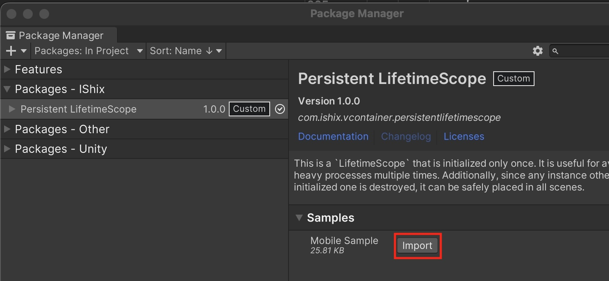

> [!IMPORTANT]
> 免責事項: このプラグインはオープンソースのサービスであり、[VContainer](https://github.com/hadashiA/VContainer)が提供する公式のサービスではありません。

# PersistentLifetimeScope

[VContainer](https://github.com/hadashiA/VContainer)に1度のみ初期化(Configure)する`LifetimeScope`を追加します。

## 特徴

- 1度しか初期化が走らないので、シーンを遷移しても消えません
- 複数のシーンに設置可能。重複する場合は削除され最初に初期化した1つのみに保たれます

## 必要な理由

- 1度しか初期化が走らない処理を実装したい場合に有用
- 初期化がハイコストな場合、1度のみ初期化する事でパフォーマンスの向上に期待できます
- モバイル端末のようなパフォーマンスにシビアな環境におすすめです

### 例


## 使用上の注意

- DontDestroyOnLoadが付与されたオブジェクトなので、アタッチするスクリプトは慎重に判断してください
- Parentの指定はできません

## サンプル

インストール後、PackageManagerからインポートしてください。



## Getting Started

### Package Managerからインストール

"Unity Editor : Window > Package Manager > Add package from git URL...".

URL: `https://github.com/IShix-g/VContainer-Extensions.git?path=Packages/PersistentLifetimeScope`


### `LifetimeScope`を作成する

- `PersistentLifetimeScope<T>`を実装
- シーンにオブジェクトを作って作成したスクリプトをアタッチ

```csharp
using VContainer;
using VContainer.Unity.Extensions;

public sealed class AppLifetimeScope : PersistentLifetimeScope<SamplePersistentLifetimeScope>
{
    protected override void Configure(IContainerBuilder builder)
    {
        // This is executed only once.
        builder.Register<AdsService>(Lifetime.Singleton);
        builder.Register<IDataRepository, PersistentDataRepository>(Lifetime.Singleton);
    }
}
```


