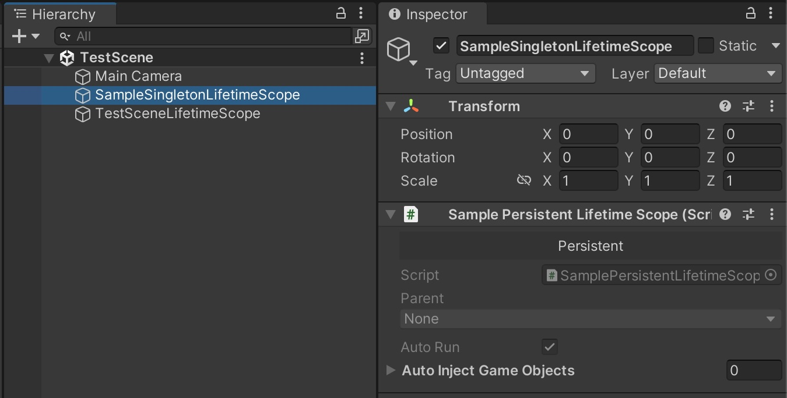

[README - 日本語版](README_jp.md)


> [!IMPORTANT]
> Disclaimer: This plugin is an open source service and is not an official service provided
> by [VContainer](https://github.com/hadashiA/VContainer).

# PersistentLifetimeScope

Adds a `LifetimeScope` to [VContainer](https://github.com/hadashiA/VContainer) that is initialized (Configured) only
once.

## Features

- Since initialization only happens once, it persists across scene transitions
- Can be placed in multiple scenes. If duplicates exist, they are removed and only the first initialized one is kept

## Why Use It

- Useful when you want to implement processes that should only be initialized once
- When initialization is costly, performing it only once can improve performance
- Recommended for performance-sensitive environments like mobile devices

## Usage Notes

- Since DontDestroyOnLoad is applied to the object, carefully consider which scripts to attach
- When setting a `PersistentLifetimeScope` as a parent, always use `PersistentChildLifetimeScope`

## Usage Example


### Complete Heavy Initialization in a Light Scene

For example, you can create an `AppLifetimeScope` to be used throughout the entire game. By initializing it in a lightweight scene, such as the title screen, you can complete heavy initialization processes in a less resource-intensive environment. Additionally, since this `AppLifetimeScope` persists across scene transitions, the heavy initialization won't run again after changing scenes.

### Place in All Scenes

Please place it in all scenes. This ensures that `AppLifetimeScope` initialization occurs regardless of which scene you
start from during development. There's no need to worry about duplication. Only the first initialized instance is used,
and others are destroyed.

## Sample

After installation, import from Package Manager and try running the scene.


## Getting Started

### Install from Package Manager

"Unity Editor : Window > Package Manager > Add package from git URL...".

```
https://github.com/IShix-g/VContainer-Extensions.git?path=Packages/PersistentLifetimeScope
```


### Creating a `PersistentLifetimeScope`

- Implement `PersistentLifetimeScope<T>`
- Create an object in the scene and attach the implemented script to it

#### [Caution]
Since this object uses DontDestroyOnLoad, carefully consider which script you attach to it.

```csharp
using VContainer;
using VContainer.Unity.Extensions;

public sealed class AppLifetimeScope : PersistentLifetimeScope<SamplePersistentLifetimeScope>
{
    protected override void OnInitialize()
    {
        // This block is executed only once and is executed before the initialization of the LifetimeScope.
    }

    protected override void OnEveryAwake(AppLifetimeScope instance)
    {
        // This block is executed every time Awake() is called and runs before the initialization of the LifetimeScope.
    }
    
    protected override void Configure(IContainerBuilder builder)
    {
        // This is executed only once.
        builder.Register<AdsService>(Lifetime.Singleton);
        builder.Register<IDataRepository, PersistentDataRepository>(Lifetime.Singleton);
    }
}
```



### Creating a `PersistentChildLifetimeScope`

- Implement `PersistentChildLifetimeScope` or a generic version of it
- Create an object in the scene and attach the implemented script to it
- Create a prefab and place it in all scenes

#### [Caution]
- Use `PersistentChildLifetimeScope` for any `LifetimeScope` that you want configured as a child of a `PersistentLifetimeScope`.
- Note that `PersistentChildLifetimeScope` behaves like a normal `LifetimeScope` and does **not** utilize DontDestroyOnLoad.

```csharp
using VContainer;
using VContainer.Unity.Extensions;

public sealed class TestSceneLifetimeScope : PersistentChildLifetimeScope
{
    protected override void Configure(IContainerBuilder builder)
    {
    }
}
```

You can specify the parent `PersistentLifetimeScope` using a Generic.

```csharp
using VContainer;
using VContainer.Unity.Extensions;

public sealed class TestSceneLifetimeScope : PersistentChildLifetimeScope<AppLifetimeScope>
{
    protected override void Configure(IContainerBuilder builder)
    {
    }
}
```

## Differences from `Root Lifetime Scope`

VContainer has a [`Root Lifetime Scope`](https://vcontainer.hadashikick.jp/scoping/project-root-lifetimescope) feature.
Like the `Persistent Lifetime Scope`, it has DontDestroyOnLoad applied and shares similar characteristics. **The key
difference is in how they are created.** Let's explore what changes due to these different creation methods.

### Creation Method Differences

- [`Root Lifetime Scope`] Automatically generated/initialized at game startup
- [`Persistent Lifetime Scope`] Manually placed in Hierarchy, initialized when scene is loaded

### [Difference 1] Auto-generation Cannot Choose Scenes

While `Root Lifetime Scope`'s automatic generation/initialization is convenient, you cannot choose which scene it
generates in. For example, it will be generated in test scenes and PlayMode tests. You need to be mindful of the
production `Root Lifetime Scope` in every scene.

### [Difference 2] Auto-generation Status Unknown Until Play

With `Root Lifetime Scope`, you cannot tell if it's configured until you enter play mode. With
`Persistent Lifetime Scope`, you can verify it in the Hierarchy since you place it manually.

### [Difference 3] `Persistent Lifetime Scope` Requires Manual Placement

Conversely, `Persistent Lifetime Scope` must be manually placed in scenes. Ideally, it should be placed in all
production scenes to work properly regardless of which scene you start from. While this requires more effort, being able
to verify in the Hierarchy is beneficial.

### [Difference 4] `Persistent Lifetime Scope` Can Use Scene References

Due to being placed in scenes, `Persistent Lifetime Scope` can utilize references to scene objects.  
For example, below is a sample code that sets up a `Canvas` to be used as a parent for generic dialogs.


```csharp
using UnityEngine;
using VContainer;
using VContainer.Unity.Extensions;

public sealed class AppLifetimeScope : PersistentLifetimeScope<AppLifetimeScope>
{
    [SerializeField] Canvas _canvas;

    // This block is executed every time Awake() is called.
    protected override void OnEveryAwake(AppLifetimeScope instance)
    {
        // Set references to the already existing instance
        instance._canvas = _canvas;
        Dialog.SetParent(_canvas);
        if (_canvas == null)
        {
            Debug.LogWarning("Canvas is not set");
        }
    }
}
```
