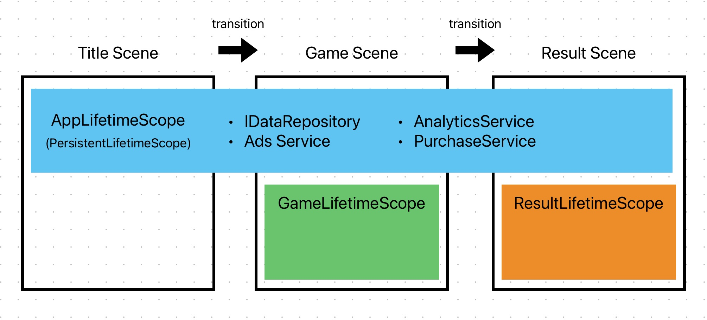
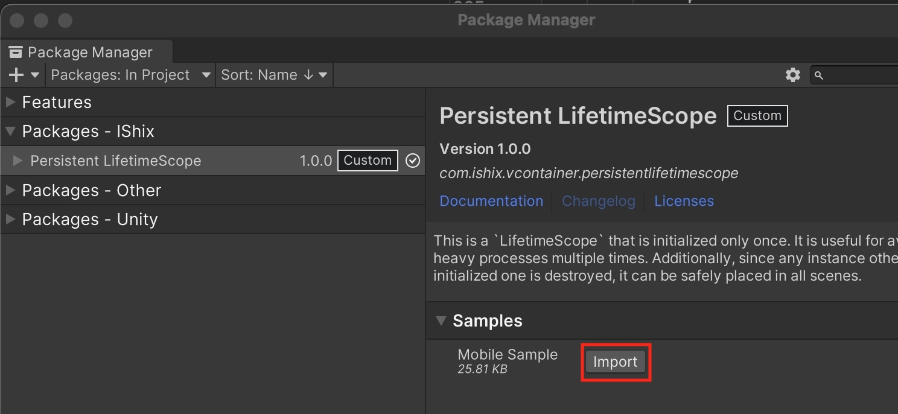
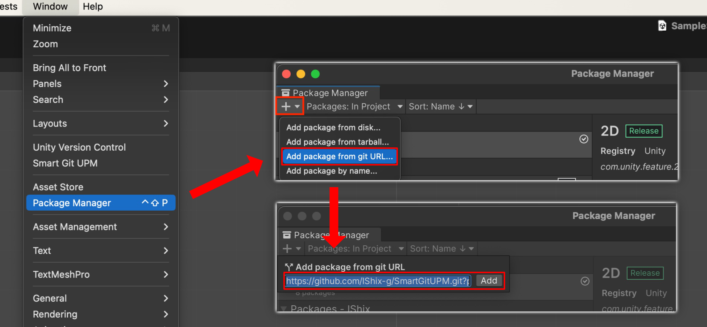
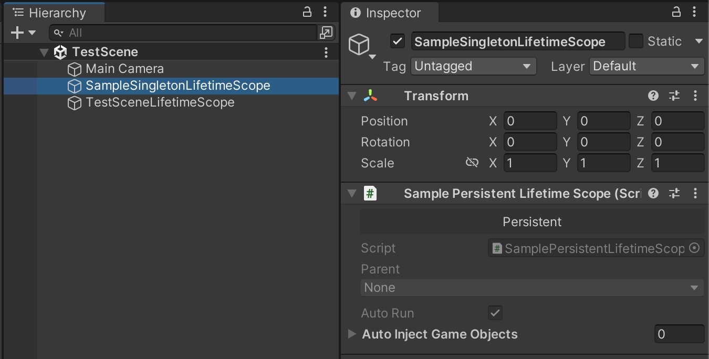

> [!IMPORTANT]
> 免責事項: このプラグインはオープンソースのサービスであり、[VContainer](https://github.com/hadashiA/VContainer)が提供する公式のサービスではありません。

# PersistentLifetimeScope

[VContainer](https://github.com/hadashiA/VContainer)に1度のみ初期化(Configure)する`LifetimeScope`を追加します。

## 特徴

- 1度しか初期化が走らないので、シーンを遷移しても消えません
- 複数のシーンに設置可能。重複する場合は削除され最初に初期化した1つのみに保たれます

## 必要な理由

- 1度しか初期化が走らない処理を実装したい場合に有用
- 初期化がハイコストな場合、1度のみ初期化する事でパフォーマンスの向上に期待できます
- モバイル端末のようなパフォーマンスにシビアな環境におすすめです

## 使用上の注意

- DontDestroyOnLoadが付与されたオブジェクトなので、アタッチするスクリプトは慎重に判断してください
- `PersistentLifetimeScope`を親に設定したい場合、必ず`PersistentChildLifetimeScope`を使用してください

## 使用例



### 重い初期化を軽いシーンで終わらせる
例えば、ゲーム全体で使用する`AppLifetimeScope`を作ります。それをタイトルシーンで初期化する事で、**軽いシーンで重い初期化を終わらせる事ができます。** そして、この`AppLifetimeScope`はシーンを遷移しても消えないので再度重い初期化が走る事はありません。

### 全シーンに設置してください
必ず全シーンに設置してほしいです。そうする事で、開発段階でどのシーンから再生しても`AppLifetimeScope`の初期化が走ります。もちろん重複の心配はありません。一番初めに初期化されたもののみ使用され、その他は破棄されます。

## サンプル

インストール後、PackageManagerからインポートしてシーンを再生して試してみてください。



## Getting Started

### Package Managerからインストール

"Unity Editor : Window > Package Manager > Add package from git URL...".

URL: `https://github.com/IShix-g/VContainer-Extensions.git?path=Packages/PersistentLifetimeScope`



### `PersistentLifetimeScope`を作成する

- `PersistentLifetimeScope<T>`を実装
- シーンにオブジェクトを作って作成したスクリプトをアタッチ
- Prefab化して全シーンに設置

#### [使用上の注意]
DontDestroyOnLoadが付与されたオブジェクトなので、アタッチするスクリプトは慎重に判断してください

```csharp
using VContainer;
using VContainer.Unity.Extensions;

public sealed class AppLifetimeScope : PersistentLifetimeScope<SamplePersistentLifetimeScope>
{
    protected override void OnInitialize()
    {
        // このブロックは1度のみ実行されます。
        // LifetimeScopeの初期化より先に実行されます。
    }

    protected override void OnEveryAwake(AppLifetimeScope instance)
    {
        // このブロックはシーンを遷移する度に呼ばれます。
    }

    protected override void Configure(IContainerBuilder builder)
    {
        // このブロックは1度のみ実行されます。
        builder.Register<AdsService>(Lifetime.Singleton);
        builder.Register<IDataRepository, PersistentDataRepository>(Lifetime.Singleton);
    }
}
```



### `PersistentChildLifetimeScope`を作成する

- `PersistentChildLifetimeScope` またはそのジェネリック版を実装
- シーンにオブジェクトを作って作成したスクリプトをアタッチ

#### [使用上の注意]
- `PersistentLifetimeScope`を親に設定したい`LifetimeScope`で`PersistentChildLifetimeScope`を使用してください
- `PersistentChildLifetimeScope`はDontDestroyOnLoadではなく普通の`LifetimeScope`です

```csharp
using VContainer;
using VContainer.Unity.Extensions;

public sealed class TestSceneLifetimeScope : PersistentChildLifetimeScope
{
    protected override void Configure(IContainerBuilder builder)
    {
    }
}
```

親になる`PersistentLifetimeScope`をGenericで指定できます。

```csharp
using VContainer;
using VContainer.Unity.Extensions;

public sealed class TestSceneLifetimeScope : PersistentChildLifetimeScope<AppLifetimeScope>
{
    protected override void Configure(IContainerBuilder builder)
    {
    }
}
```
